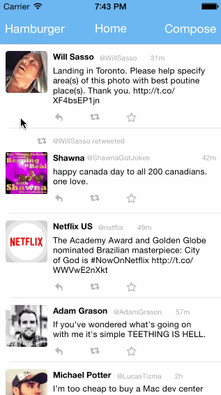

TwitterRedux
============

Part 2 of the Twitter client

Time spent: 12 hours

Completed user stories:

 * [x] Required: Dragging anywhere in the view should reveal the menu.
 * [x] Required: The menu should include links to your profile, the home timeline, and the mentions view.
 * [x] Required: The menu can look similar to the LinkedIn menu below or feel free to take liberty with the UI.
 * [x] Required: Contains the user header view
 * [x] Required: Contains a section with the users basic stats: # tweets, # following, # followers
 * [x] Required: Tapping on a user image should bring up that user's profile page

Notes:

I spent a bit of time refactoring previous code to make it easier to integrate.

Walkthrough of all user stories:

> 

GIF created with [LiceCap](http://www.cockos.com/licecap/).